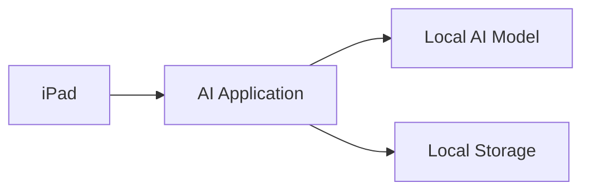
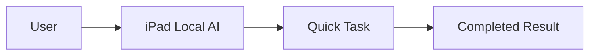
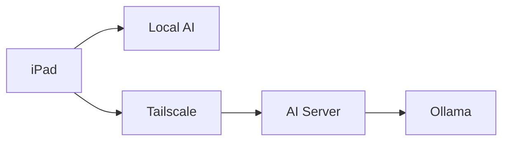

# Local AI Access

> **System Component:** Local Device AI Environment  
>
> **Purpose:** Provide a private, portable artificial intelligence assistant that runs directly on the user's device without requiring access to the central AI server.

---

# Overview

***"How do I use AI anywhere?"***

The Local AI environment is the lightweight side of the dual-mode AI architecture.

Instead of depending entirely on a remote server or cloud-based service, the user's device can run a smaller AI model directly from their device.

This provides:

<div class="grid cards" markdown>

- :material-tablet: **Portable AI Assistant**

    ---

    AI access directly from the iPad.

    Available for:

    - Questions
    - Writing
    - Notes
    - Brainstorming
    - Planning

- :material-shield-lock: **Private Processing**

    ---

    Information remains on the local device.

    No external AI provider is required.

- :material-wifi-off: **Offline Capability**

    ---

    Useful when:

    - Internet is unavailable
    - Traveling
    - Working remotely
    - Accessing private information

</div>

---

# Purpose

The Local AI system exists to provide a fast, simple assistant for everyday tasks.

It is designed around convenience and privacy.

Common uses include:

- Drafting emails
- Creating notes
- Organizing ideas
- Summarizing information
- Creating checklists
- Brainstorming solutions
- Answering general questions
- Personal productivity

!!! info

    Local AI is the everyday assistant.

    The remote AI server handles heavier workloads requiring more processing power, storage, and memory.

---

# System Architecture

The Local AI environment runs entirely on the user's device.



The local system contains three primary components:

| Component | Purpose |
|---|---|
| AI Application | Provides the user interface |
| AI Model | Generates responses and reasoning |
| Local Storage | Stores models and local conversations |

---

# Local AI Advantages

<div class="grid cards" markdown>

- :material-lock: **Privacy**

    ---

    Information stays on the device.

- :material-lightning-bolt: **Speed**

    ---

    No network delay for responses.

- :material-currency-usd-off: **No Subscription**

    ---

    No required monthly AI service.

- :material-earth: **Anywhere Access**

    ---

    Works wherever the device is available.

</div>

---

# Recommended Hardware

## Ideal Devices

Recommended:

- iPad Pro M1/M2/M4
- iPad Air M1/M2

Minimum:

- 6GB+ RAM
- 5-15GB available storage

---

# Local AI Applications

The device requires an application capable of running local AI models.

Examples:

- MLC Chat
- Layla AI

The application provides:

- Model management
- Chat interface
- Local processing
- Device integration

---

# Choosing a Local Model

Local devices have limited processing power compared to dedicated AI servers.

Models should prioritize efficiency.

Recommended models:

| Model | Size | Recommended Use |
|---|---|---|
| Gemma 3 1B | Very Small | Fast assistant |
| Gemma 3 4B | Balanced | General tasks |
| Phi-3 Mini | Lightweight | Writing assistance |
| Qwen 2.5 3B | Balanced | Notes and organization |

---

!!! warning

    Large AI models may not perform well on mobile devices.

    Larger models increase:

    - Battery usage
    - Heat generation
    - Storage requirements
    - Response time

---

# Installing Local AI

## Step 1 — Install AI Application

1. Open the application store.
2. Install the selected local AI application.
3. Open the application.
4. Allow required permissions.

---

## Step 2 — Download AI Model

Select a compatible model.

Recommended starting point:

```text
Gemma 3 4B Q4
```

The Q4 version is compressed to reduce memory usage while maintaining useful performance.

---

## Step 3 — Verify Local Operation

Disable WiFi temporarily.

Ask:

```text
Create a checklist for organizing receipts.
```

Successful response confirms the local model is operating.

---

# Daily Usage

The normal workflow is:



Example:

User:

> Create a checklist for preparing business paperwork.

Local AI:

> Creates checklist immediately without contacting a server.

---

# Recommended Local Tasks

## Personal Productivity

<div class="grid cards" markdown>

- :material-note-text: **Notes**

    ---

    Capture ideas and reminders.

- :material-pencil: **Writing**

    ---

    Draft emails and documents.

- :material-clipboard-check: **Planning**

    ---

    Create lists and workflows.

- :material-lightbulb: **Brainstorming**

    ---

    Generate ideas and solutions.

</div>

---

# Business Usage

Local AI can assist with simple business tasks:

Examples:

- Drafting customer messages
- Creating reminders
- Making checklists
- Reviewing small documents
- Organizing thoughts

However, larger business processes should use the remote AI server.

---

# Local AI Limitations

The Local AI environment is not designed for:

- Large PDF analysis
- Thousands of receipts
- Long-term memory storage
- Large databases
- Automated business workflows
- Complex document processing

These tasks require the remote AI environment.

---

# Local AI vs Remote AI

| Feature | Local AI | Remote AI |
|---|---|---|
| Location | iPad | Dedicated Server |
| Internet Required | No | Tailscale Connection |
| Speed | Fast for small tasks | Faster for large tasks |
| Model Size | Small | Large |
| Storage | Limited | Expandable |
| Memory System | Basic | Advanced |
| Receipt Processing | Limited | Recommended |
| Automation | Limited | Full Support |

---

# Connection to Remote AI

The Local AI system is one half of the complete architecture.



The user chooses the appropriate system:

## Use Local AI

For:

- Quick questions
- Notes
- Writing
- Brainstorming

## Use Remote AI

For:

- Receipts
- Business records
- Large documents
- Memory searches
- Automation

---

# Security Considerations

Local AI provides strong privacy because information remains on the device.

Recommended practices:

- Keep device security enabled
- Use device encryption
- Keep applications updated
- Avoid storing unnecessary sensitive data locally

---

# Maintenance

Regular maintenance:

<div class="grid cards" markdown>

- :material-update: **Update Applications**

    ---

    Keep AI applications current.

- :material-delete: **Manage Storage**

    ---

    Remove unused models.

- :material-shield-check: **Review Security**

    ---

    Maintain device protection.

</div>

---

# Troubleshooting

## AI Application Will Not Start

Check:

- Available storage
- Device compatibility
- Application updates

---

## AI Responses Are Slow

Possible causes:

- Model is too large
- Device memory is limited
- Battery-saving mode is active

Solution:

Try a smaller model.

---

## Model Will Not Download

Check:

- Internet connection
- Available storage
- Application permissions

---

# Design Philosophy

!!! quote

    Local AI provides independence.

    Remote AI provides capability.

    Together they create a private assistant that adapts to the user's needs.

---

# Final Concept

The complete AI system is divided into three layers:

<div class="grid cards" markdown>

- :material-tablet: **Interface**

    ---

    The iPad provides the user experience.

- :material-brain: **Intelligence**

    ---

    AI models provide reasoning and communication.

- :material-database: **Memory**

    ---

    The server stores knowledge and experience.

</div>

The iPad is the **control panel**.

The AI server is the **intelligence engine**.

The documentation system is the **memory foundation**.