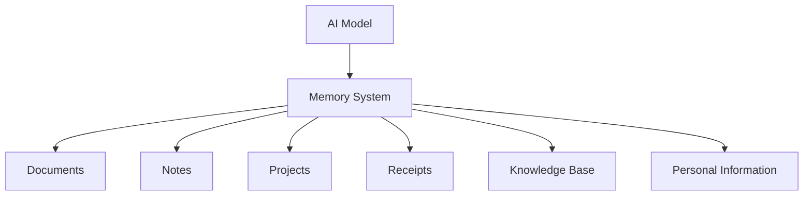
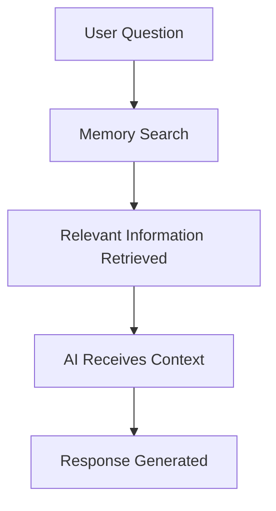
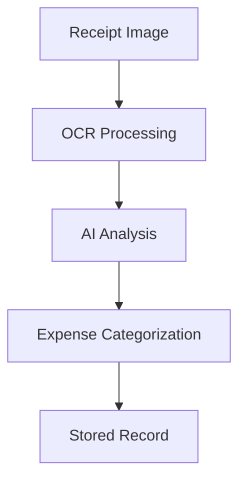

# Overview

> **Project Type:** Private, locally hosted artificial intelligence environment  
>
> **Purpose:** Create a personal AI assistant that combines intelligence, memory, and documentation into one private knowledge system.

---

# Purpose

The goal of this project is to create a **personal, locally hosted artificial intelligence system** that functions as:

- :material-robot: **Personal Assistant**

    ---

    Helps with:

    - Questions
    - Writing
    - Planning
    - Daily tasks

- :material-database: **Knowledge Manager**

    ---

    Organizes:

    - Documents
    - Notes
    - Projects
    - Personal records

- :material-cog: **Automation Platform**

    ---

    Supports:

    - Workflows
    - Business processes
    - Document processing
    - Repetitive tasks

---

Unlike traditional cloud-based AI services, this system is designed around:

- Self-hosted AI models
- Local storage
- Personal infrastructure
- Custom workflows
- User-controlled data

!!! info

    This project is not about creating another chatbot.

    The goal is to create a private AI environment that understands the user's information, projects, and workflows.

---

# Why Local Hosting

## Privacy and Data Ownership

A locally hosted AI system keeps information under the user's control.

Personal documents, business records, receipts, notes, and project files can be processed without requiring outside services.

Important use cases include:

- :material-file-lock: **Private Documents**

    ---

    Personal records, notes, and documentation.

- :material-cash: **Financial Information**

    ---

    Receipts, expenses, and business records.

- :material-folder-lock: **Private Projects**

    ---

    Engineering work, designs, and family systems.

The user controls:

- Where data is stored
- How it is accessed
- How backups are created
- How the system evolves

---

# Customization

Cloud AI systems are designed for general users.

A local AI system can be designed around a specific environment.

The AI can be trained through access to:

- Personal documentation
- Project knowledge
- Business procedures
- Technical references
- Preferred workflows
- Custom tools

!!! example

    A general AI knows how to answer questions.

    A personal AI knows how **you organize information, document projects, and complete tasks.**

---

# Reliability and Independence

A locally hosted system reduces dependence on external services.

The system can continue operating even when:

- Internet access is unavailable
- Subscription costs increase
- External services change
- Data policies change

The infrastructure, models, and knowledge base remain controlled by the user.

---

# The Role of Memory

A traditional chatbot only understands the current conversation.

Once the conversation ends, information is lost unless manually saved.

This system approaches memory differently.

Instead of forcing the AI model itself to remember everything, memory is built as a separate layer.

The separation creates a cleaner architecture:

| Component | Responsibility |
|---|---|
| AI Model | Reasoning and language understanding |
| Memory System | Finding and organizing information |
| Documentation | Providing structured knowledge |

---

# Retrieval-Augmented Memory

The system uses retrieval-based memory instead of loading all information into the AI model at once.

The workflow:

This allows the AI to access large amounts of information without overwhelming the model.

Benefits:

- :material-brain: **Better Memory**

    ---

    Long-term knowledge retention.

- :material-speedometer: **Efficiency**

    ---

    Reduced token usage and faster responses.

- :material-folder-search: **Organization**

    ---

    Structured access to stored information.

- :material-check-circle: **Accuracy**

    ---

    Responses based on relevant stored information.

---

# Personal Knowledge System

The AI system works alongside the Life Systems documentation platform.

Markdown files, technical notes, project documentation, and personal records become part of the AI knowledge base.

Examples:

- Engineering documentation
- Linux configuration notes
- AI architecture notes
- Business procedures
- Equipment documentation
- Maintenance records

The documentation becomes the foundation of the AI's understanding.

---

# Future Applications

## Business Assistant

A locally hosted assistant can help organize:

- Receipts
- Expenses
- Tax documentation
- Business records
- Reports

Example workflow:

---

## Personal Automation

Future capabilities may include:

- File organization
- Report generation
- Documentation updates
- Searching personal archives
- Creating summaries
- Managing recurring tasks

---

# Long-Term Vision

!!! quote

    The goal is not simply to create a stronger chatbot.

    The goal is to create a personal information system where artificial intelligence becomes the interface between the user and their own knowledge.

---

The system is built from three parts:

- :material-brain: **Intelligence**

    ---

    The AI model provides reasoning and communication.

- :material-memory: **Experience**

    ---

    The memory system provides access to accumulated information.

- :material-file-tree: **Structure**

    ---

    Documentation provides organization and context.

Together, these components create a private AI assistant that grows alongside the user's:

- Projects
- Responsibilities
- Business
- Knowledge
- Workflows

The AI does not replace the user's information system.

It becomes the interface for interacting with it.