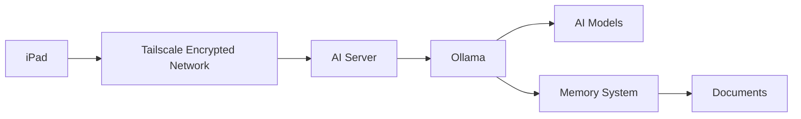
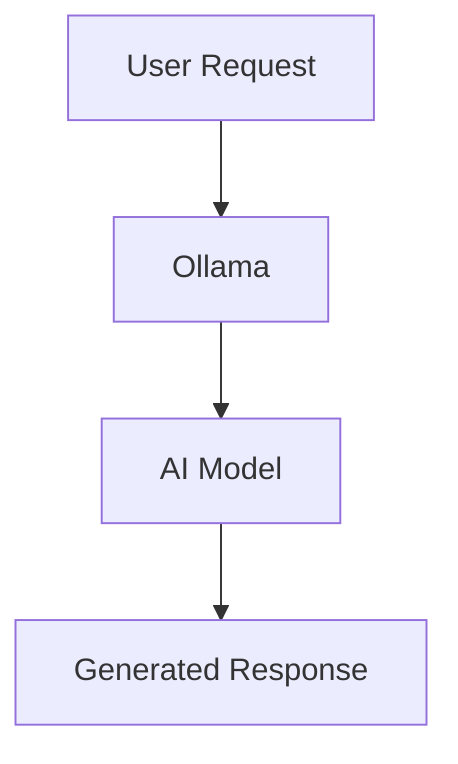
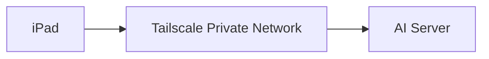
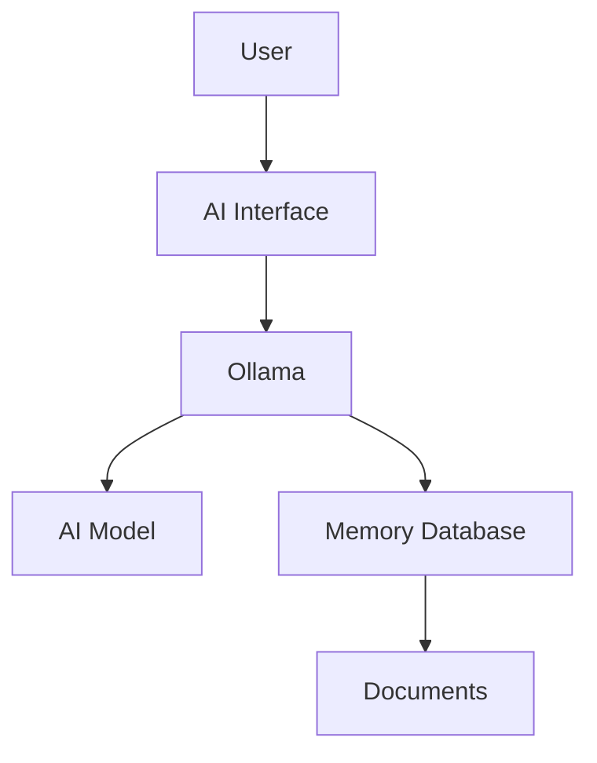
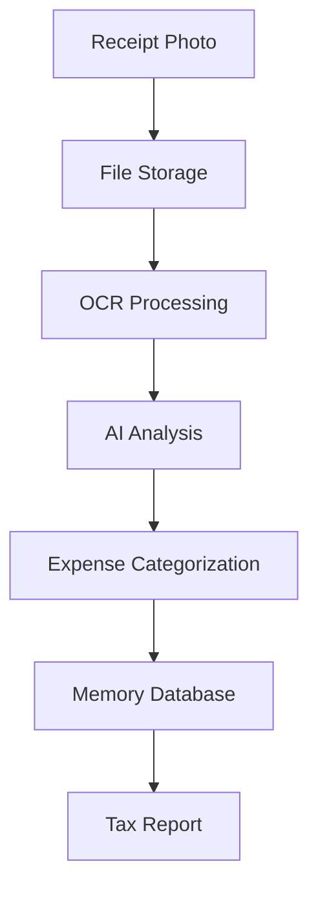
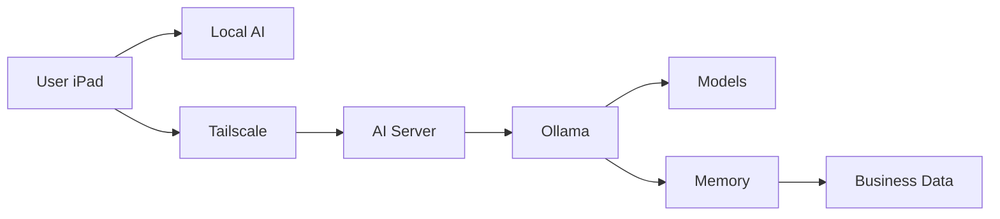

# Remote AI Access

> **System Component:** Remote AI Server Environment  
>
> **Purpose:** Provide a powerful, private AI processing environment accessible securely from user devices through an encrypted network.

---

# Overview

***"How does the AI infrastructure work?"***

The Remote AI environment is the primary intelligence layer of the system.

Unlike the lightweight Local AI model running on the iPad, the remote server is designed for:

<div class="grid cards" markdown>

- :material-server: **High Performance AI**

    ---

    Runs larger AI models using dedicated hardware.

    Designed for:

    - Complex reasoning
    - Large documents
    - Extended conversations
    - Advanced workflows

- :material-database: **Long-Term Knowledge**

    ---

    Stores and retrieves information using:

    - Documents
    - Notes
    - Projects
    - Receipts
    - Knowledge databases

- :material-cog: **Automation Platform**

    ---

    Provides infrastructure for:

    - Business workflows
    - Document processing
    - AI agents
    - Future integrations

</div>

---

# Purpose

The Remote AI server acts as the central intelligence engine.

The user's devices connect to the server securely instead of sending information to external AI providers.

The server provides:

- Larger AI models
- Increased processing power
- Persistent storage
- Memory systems
- Document indexing
- Automation capabilities

!!! info

    The iPad is the interface.

    The server is the intelligence layer.

---

# System Architecture



---

# Why Remote AI?

Mobile devices are excellent interfaces, but they have limitations.

A dedicated AI server provides:

<div class="grid cards" markdown>

- :material-memory: **More Memory**

    ---

    Supports larger AI models.

- :material-speedometer: **More Processing**

    ---

    Handles complex workloads faster.

- :material-harddisk: **More Storage**

    ---

    Maintains documents and knowledge bases.

- :material-account-cog: **Automation**

    ---

    Enables repeatable workflows.

</div>

---

# Server Requirements

## Minimum Configuration

```text
CPU:
6+ cores

RAM:
16GB+

Storage:
100GB+

GPU:
Optional
```

---

## Recommended Configuration

```text
CPU:
8+ cores

RAM:
32GB+

Storage:
500GB+ SSD

GPU:
NVIDIA GPU
8GB+ VRAM
```

---

# Hardware Considerations

## CPU

The processor handles:

- System operations
- AI inference
- Document processing
- Automation services

More cores improve multitasking.

---

## RAM

RAM is one of the most important resources.

Larger models require more memory.

Example:

| RAM | Capability |
|---|---|
| 16GB | Small to medium models |
| 32GB | Comfortable AI workloads |
| 64GB+ | Large models and multiple services |

---

## GPU

A GPU is optional but improves AI performance significantly.

Recommended:

- NVIDIA GPU
- CUDA support
- 8GB+ VRAM

GPU acceleration allows:

- Faster responses
- Larger models
- Multiple users

---

# Ollama AI Engine

## Overview

Ollama provides the model management and inference engine.

It handles:

- Downloading models
- Running models
- Managing AI requests
- Providing an API interface

Architecture:



---

# Installing Ollama

## Install

```bash
curl -fsSL https://ollama.com/install.sh | sh
```

Verify:

```bash
ollama --version
```

---

# Installing AI Models

Example:

```bash
ollama pull gemma3:4b
```

Test:

```bash
ollama run gemma3:4b
```

---

# Model Storage

Ollama stores downloaded models locally.

Benefits:

- No repeated downloads
- Faster startup
- Offline operation

Models can be managed:

List models:

```bash
ollama list
```

Remove a model:

```bash
ollama rm model_name
```

---

# Network Configuration

By default, Ollama only accepts local connections.

To allow secure remote access:

Edit the service:

```bash
sudo systemctl edit ollama
```

Add:

```bash
[Service]

Environment="OLLAMA_HOST=0.0.0.0"
```

Restart:

```bash
sudo systemctl restart ollama
```

Test:

```bash
curl http://localhost:11434/api/tags
```

---

# Secure Remote Access With Tailscale

## Purpose

Tailscale creates a private encrypted network between approved devices.

Instead of exposing AI services directly to the internet:

```text
Internet

    X

Ollama Server
```

The system uses:



---

# Install Tailscale

## Server

Install:

```bash
curl -fsSL https://tailscale.com/install.sh | sh
```

Authenticate:

```bash
sudo tailscale up
```

Check connection:

```bash
tailscale status
```

Example:

```text
server-name

100.x.x.x
```

---

## iPad

Install Tailscale.

Sign in using the same account.

The iPad and server should now appear on the same private network.

---

# Connecting To Ollama

The iPad application connects using the server's Tailscale address.

Example:

```text
http://100.x.x.x:11434
```

Where:

```text
100.x.x.x
```

is the server's private Tailscale IP.

---

# Recommended Software Stack

The complete AI server:

```text
Docker

├── Ollama
│
├── Open WebUI / Odysseus
│
├── ChromaDB
│
├── OCR Service
│
├── File Storage
│
└── Tailscale
```

---

# Memory System Integration

The AI model itself does not permanently remember information.

Memory is added as a separate layer.



The memory system allows the AI to reference:

- Past projects
- Documentation
- Business information
- Receipts
- Personal knowledge

---

# Receipt Processing Example

A business workflow:



---

# Security Design

!!! danger

    Never expose Ollama directly to the public internet.

Avoid:

```text
Internet

↓

Port 11434

↓

Ollama
```

Recommended:

```text
iPad

↓

Encrypted Tailscale Network

↓

AI Server

↓

Ollama
```

---

# Authentication

Recommended security practices:

- Use strong device passwords
- Enable multi-factor authentication
- Restrict Tailscale device access
- Keep software updated
- Maintain backups

---

# Testing The System

## Test Ollama

```bash
ollama run gemma3:4b
```

Expected:

AI responds locally.

---

## Test Network Access

From another device:

```bash
curl http://100.x.x.x:11434/api/tags
```

Expected:

Available model list returned.

---

## Test AI Interface

Verify:

- Device connects
- Model loads
- Responses generate
- Memory search works

---

# Maintenance

Regular tasks:

<div class="grid cards" markdown>

- :material-update: **Software Updates**

    ---

    Update:

    - Ollama
    - Docker
    - Tailscale
    - Interfaces

- :material-database-check: **Data Maintenance**

    ---

    Verify:

    - Backups
    - Storage
    - Databases

- :material-chart-line: **Performance Review**

    ---

    Monitor:

    - RAM usage
    - Storage
    - Model performance

</div>

---

# Troubleshooting

## Cannot Connect From iPad

Check:

```bash
tailscale status
```

Verify:

- Both devices are online
- Same Tailscale account
- Server IP is correct

---

## Ollama Works Locally But Not Remotely

Check:

```bash
curl http://localhost:11434/api/tags
```

If successful:

Verify:

- OLLAMA_HOST configuration
- Firewall settings
- Tailscale connection

---

## AI Responses Are Slow

Possible causes:

- Model too large
- Insufficient RAM
- No GPU acceleration

Solutions:

- Use smaller model
- Add RAM
- Enable GPU acceleration

---

# Expansion Possibilities

The remote AI server can eventually support:

<div class="grid cards" markdown>

- :material-robot-outline: **AI Agents**

    ---

    Automated task execution.

- :material-file-search: **Document Intelligence**

    ---

    Search and analyze archives.

- :material-briefcase: **Business Assistant**

    ---

    Manage workflows and records.

- :material-home-automation: **Personal Systems**

    ---

    Connect with smart devices.

</div>

---

# Final Architecture



---

# Design Philosophy

!!! quote

    Local AI provides independence.

    Remote AI provides capability.

    Memory provides continuity.

    Documentation provides structure.

---

The Remote AI server is the foundation that allows the entire AI ecosystem to grow.

It transforms artificial intelligence from a simple chatbot into a private, expandable knowledge system.