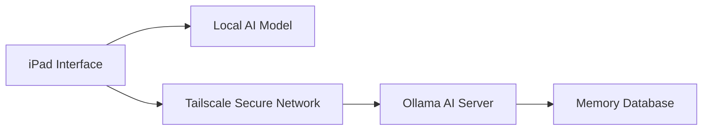
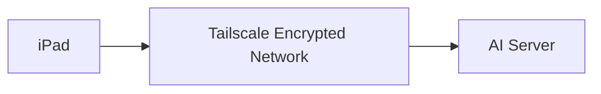
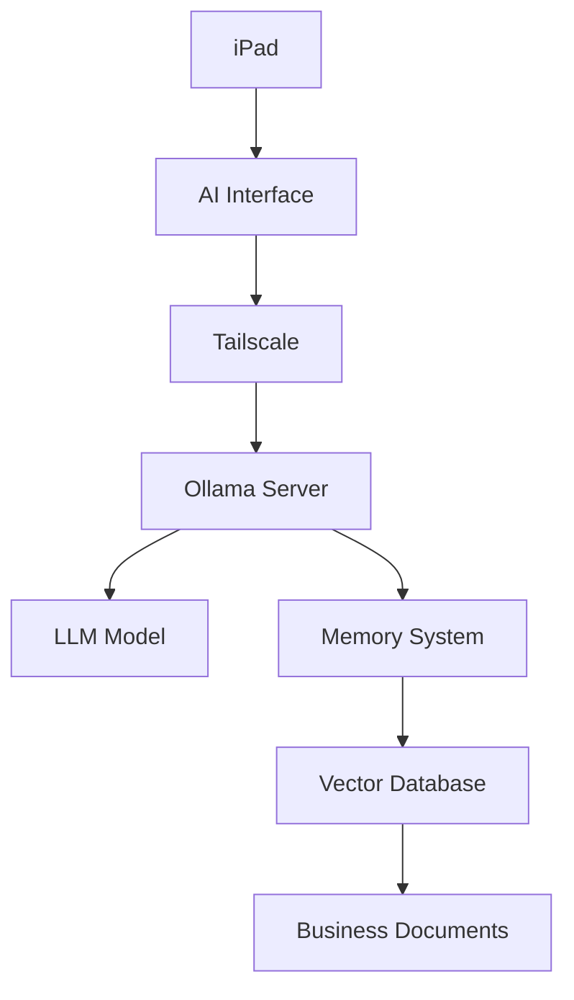
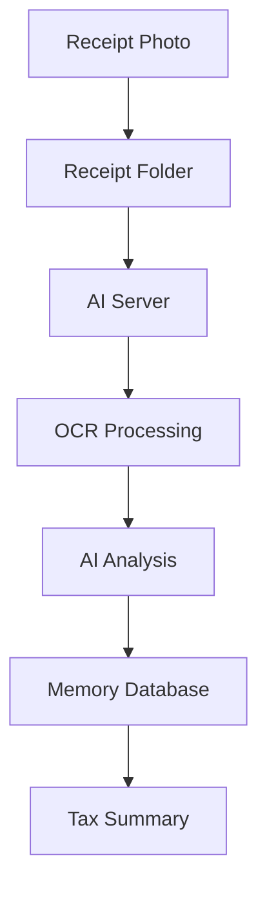
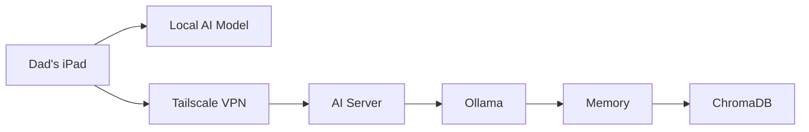

# Setup

> **System Purpose:**  
> Create a private, family-owned AI assistant that combines the convenience of local iPad AI with the power of a dedicated AI server.

---

## Overview

This system uses a **hybrid AI architecture** consisting of two separate but connected environments:

<div class="grid cards" markdown>

- :material-tablet: **Local iPad AI**

    ---

    Lightweight AI assistant running directly on the iPad.

    **Best for:**

    - Quick questions
    - Writing assistance
    - Brainstorming
    - Notes
    - Offline usage

    **Advantages:**

    - No internet required
    - Private device storage
    - Always available

- :material-server: **Remote AI Server**

    ---

    Dedicated AI workstation running larger models through Ollama.

    **Best for:**

    - Receipt processing
    - Business documentation
    - Tax organization
    - File analysis
    - Long-term memory
    - Large document processing

    **Advantages:**

    - More powerful models
    - Expandable storage
    - Persistent memory

</div>

---

## System Goal

The goal is to create an AI assistant that behaves less like a chatbot and more like a **private business tool**.

The iPad acts as the user interface.

The server provides the intelligence, storage, and automation.



---

# Architecture 1 — Local iPad AI

## Purpose

The local iPad AI provides a personal assistant that works without depending on external services or a server connection.

Recommended uses:

- Writing emails
- Creating notes
- Summarizing documents
- Brainstorming ideas
- Basic business questions
- Quick calculations
- Personal productivity

!!! info

    Local models are intentionally smaller because iPads have limited RAM, battery capacity, and storage compared to a dedicated computer.

---

# Hardware Requirements

## Recommended Devices

- iPad Pro M1/M2/M4
- iPad Air M1/M2

## Minimum Requirements

- iPad with 6GB+ RAM
- 5-15GB available storage

---

# Local AI Applications

A local AI application capable of running CoreML or GGUF models is required.

Examples:

- MLC Chat
- Layla AI

These applications allow the iPad to download and run AI models directly on the device.

---

# Choosing a Local Model

The iPad should use a smaller quantized model.

| Model | Size | Recommended Use |
|---|---|---|
| Gemma 3 1B | Very Small | Quick assistant |
| Gemma 3 4B | Balanced | General tasks |
| Phi-3 Mini | Lightweight | Writing and reasoning |
| Qwen 2.5 3B | Balanced | Business notes |

!!! warning

    Avoid running very large models locally.

    Larger models increase:

    - Battery consumption
    - Heat generation
    - Storage requirements
    - Response time

---

# Installing the Local Model

## Step 1 — Install AI Application

1. Download the selected AI application.
2. Open the application.
3. Configure local model storage if required.

---

## Step 2 — Download Model

Example:

```text
Gemma 3 4B Q4
```

The Q4 version uses compression to reduce memory requirements while maintaining usable performance.

---

## Step 3 — Test Local Operation

Disable WiFi temporarily.

Ask:

```text
Create a checklist for organizing receipts.
```

A successful response confirms local AI operation.

---

# Local AI Limitations

The iPad model is not designed for:

- Large PDF processing
- Thousands of receipts
- Long-term memory
- Large databases
- Business automation

These workloads move to the AI server.

---

# Architecture 2 — Remote Ollama AI Server

## Purpose

The AI server acts as the primary intelligence layer.

It provides:

- Larger language models
- Persistent memory
- File processing
- Business workflows
- Document indexing
- Receipt organization

The iPad connects securely through Tailscale.

---

# Server Requirements

## Minimum

```text
CPU:
6+ cores

RAM:
16GB+

Storage:
100GB+

GPU:
Optional
```

---

## Recommended

```text
NVIDIA GPU
8GB+ VRAM

32GB RAM

SSD Storage
```

---

# Installing Ollama

## Install

```bash
curl -fsSL https://ollama.com/install.sh | sh
```

Verify:

```bash
ollama --version
```

---

# Download AI Models

Example:

```bash
ollama pull gemma3:4b
```

Test:

```bash
ollama run gemma3:4b
```

---

# Enable Network Access

By default, Ollama only accepts local connections.

Edit configuration:

```bash
sudo systemctl edit ollama
```

Add:

```bash
[Service]
Environment="OLLAMA_HOST=0.0.0.0"
```

Restart:

```bash
sudo systemctl restart ollama
```

Verify:

```bash
curl http://localhost:11434/api/tags
```

---

# Secure Remote Access Using Tailscale

!!! danger

    Never expose Ollama directly to the public internet.

Bad:

```text
Internet
    |
    |
Ollama Port 11434
```

Recommended:



---

# Install Tailscale

Server:

```bash
curl -fsSL https://tailscale.com/install.sh | sh
```

Login:

```bash
sudo tailscale up
```

Verify:

```bash
tailscale status
```

Example:

```text
server-name
100.x.x.x
```

---

# Connect iPad

Install Tailscale on the iPad.

Sign into the same account.

The iPad should now see the AI server through the private Tailscale network.

---

# Connecting iPad AI to Ollama

The AI interface connects using the server's Tailscale address:

```text
http://100.x.x.x:11434
```

Where:

```text
100.x.x.x
```

is the server's Tailscale IP address.

---

# Adding Long-Term Memory

The AI model itself does not automatically remember information.

Memory requires an additional database layer.

Architecture:



---

# Receipt Processing Workflow

Example:

A receipt is photographed on the iPad.



Example output:

```text
2026 Expenses

Fuel:
$1,240

Equipment:
$3,500

Office:
$820

Total:
$5,560
```

---

# Recommended Server Stack

```text
Docker

├── Ollama
├── Open WebUI / Odysseus
├── ChromaDB
├── OCR Service
├── File Storage
└── Tailscale
```

---

# Daily Operation

## Normal Usage

The iPad primarily uses:

```text
Local AI
```

For:

- Notes
- Questions
- Writing
- Quick assistance

---

## Business Workflow

Receipts are uploaded:

```text
Receipts/

├── January
├── February
└── March
```

The AI server:

1. Reads receipts
2. Extracts information
3. Categorizes expenses
4. Updates records

---

# Final Architecture



---

# Why This Architecture Works

## Local AI

Advantages:

- Private
- Always available
- No subscription
- Works anywhere

---

## Server AI

Advantages:

- More powerful
- Expandable
- Long-term memory
- Business automation

---

## Final Result

Together, these systems create a personal AI assistant that is:

- Private
- Family-owned
- Expandable
- Independent from commercial AI providers

The iPad becomes the **control panel**.

The server becomes the **intelligence layer**.