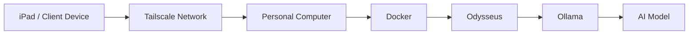
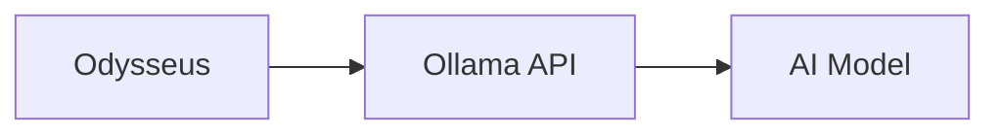
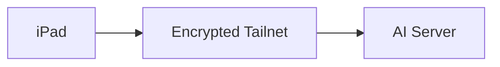
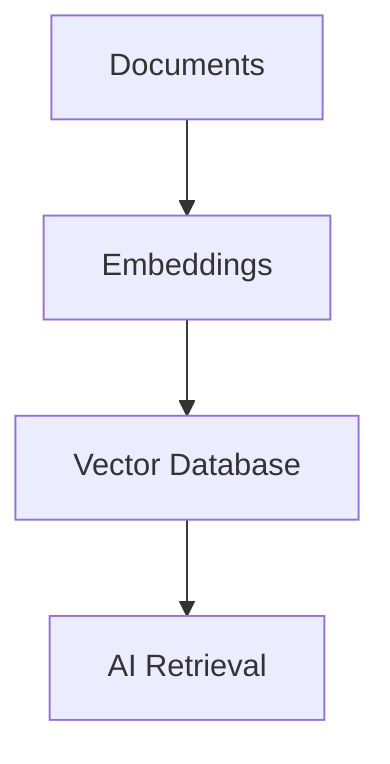
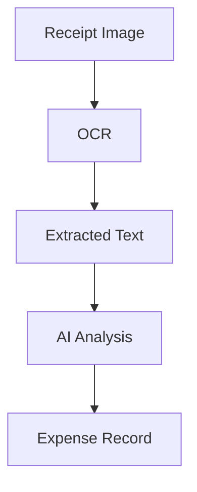

# Remote AI Server Practice Lab

> **Project Type:** Experimental AI Infrastructure Lab  
>
> **Purpose:** Build and test a complete private AI server environment using personal hardware before deploying a production system.

---

# Overview

This lab is a practice environment for learning how a complete self-hosted AI system operates.

The goal is to recreate the same architecture planned for the personal AI assistant system using:

- Personal computer hardware
- Docker containers
- Ollama
- Tailscale
- Odysseus
- Local AI models

This allows testing and experimentation without affecting a production environment.

---

# Lab Objective

The purpose of this project is to understand the complete AI infrastructure stack:

<div class="grid cards" markdown>

- :material-server: **AI Server**

    ---

    Host local AI models and provide processing power.

- :material-database: **Container Platform**

    ---

    Manage AI services using Docker containers.

- :material-shield-lock: **Private Networking**

    ---

    Secure remote access through Tailscale.

- :material-robot: **AI Interface**

    ---

    Provide a user-friendly assistant through Odysseus.

</div>

---

# Practice Architecture

The lab recreates the following environment:



The computer becomes the AI server.

The iPad becomes the remote client.

---

# Hardware Environment

Example practice server:

```text
Computer:

CPU:
Intel i7-9750H

GPU:
NVIDIA GTX 1650 4GB VRAM

RAM:
16GB+

Operating System:
Windows + Docker Desktop
```

This hardware is suitable for learning and testing.

---

# Model Expectations

This system is designed for smaller local models.

Recommended models:

| Model | Purpose |
|---|---|
| Gemma 3 1B | Fast testing |
| Gemma 3 4B | General assistant |
| Phi-3 Mini | Writing tasks |
| Qwen 2.5 3B | Notes and organization |

Large models may require:

- More RAM
- More VRAM
- Dedicated server hardware

---

# Lab Software Stack

The practice environment uses:

```text
AI Server

├── Docker Desktop
│
├── Ollama
│
├── Odysseus
│
├── ChromaDB
│
├── SearXNG
│
├── Ntfy
│
└── Tailscale
```

---

# Installation Workflow

## Phase 0 -- Verify your Environment

Before touching the AI server, make sure your development environment is healthy.

### ***Windows***
Verify:

    - Docker Desktop starts normally
    - Ollama is installed
    - NVIDIA drivers are working (If using GPU acceleration)
    - Git is installed

Commands:
```PowerShell
docker --version

ollama --version

git --version
```

---

### ***WSL***

Start Ubuntu. 

Verify:
```bash
python3 --version

pip --version

docker --version # Docker Desktop must be started via app or PowerShell
```

---

### ***Virtual Environment***

Activate the MkDocs virtual environment
```bash
source ~/venvs/StaticWebpage_Life-Systems/bin/activate
```

Verify:
```bash
mkdocs serve
```

Your documentation site should open normally

---

At this point you know your documentation environment is healthy before changing anything.

---

## Phase 1 -- Build the AI Server Folder

This is separate from your MkDocs project.

Example:
```markdown
C:\Engineering\Projects

├── StaticWebpage_Life-Systems
│
└── AI-Server-Lab
```

Inside:
```markdown
AI-Server-Lab
│
├── docker-compose.yml
├── .env
├── README.md
│
├── data
│   ├── chromadb
│   ├── odysseus
│   └── documents
│
├── backups
│
├── logs
│
└── scripts
```

Why this layout?

   -  `docker-compose.yml` — defines all your containers.
   -  `.env` — stores configuration (ports, passwords, URLs).
   -  `README.md` — quick notes about the project.
   -  `data/` — persistent data that survives container restarts.
   -  `backups/` — exported databases and important files.
   -  `logs/` — log files if you choose to save them.
   -  `scripts/` — helper scripts for backups, updates, or maintenance.

**Recommended**
Keep this project on the Windows file system
It's the same pattern as MkDocs.

   -  Project files: Windows filesystem
   -  Development tools: WSL
   -  Docker Engine: Windows (via Docker Desktop)

That gives you:

   - Easy access from Windows apps.
    - Easy editing in VS Code.
    - Docker can mount the folders without issue.
    - WSL can still work in the project directory through /mnt/c/....

---

## Phase 2 -- Install Ollama

Verify:
```PowerShell
ollama list
```

If nothing appears:
```PowerShell
ollama pull gemma3:4b
```

Run:
```PowerShell
ollama run gemma3:4b
```

Ask:
`Hello`

If it answers, Success.

---

## Phase 3 -- Learn the Ollama API

**Don't skip this -- Very common process people skip**

Everything else eventually talks to Ollama through its API

Open another terminal.

Run:
```PowerShell
curl http://localhost:11434/api/tags
```

You'll receive JSON.

(You have successfully talked directly to your AI server)

---

## Phase 4 -- Install Docker Services

Now we can containerize.

Eventually your stack becomes:
```markdown
Docker

├── Odysseus

├── ChromaDB

├── SearXNG

├── Ntfy
```

For now, focus on `Odysseus`. 

---

## Connect Docker to Ollama

This is the first "network" lesson.

Docker containers cannot magically see Windows.

You'll use:<br>
`host.docker.internal`<br>

Instead of<br>
`localhost`<br>

Example:<br>
`OLLAMA_BASE_URL=http://host.docker.internal:11434`<br>

If odysseus answers, success

---

## Phase 6 -- Learn Docker

Before continuing, intentionally break things.

Learn:
```markdown
docker ps

docker stop

docker start

docker logs

docker exec

docker compose up

docker compose down
```

You shoul become comfortable restarting services.

---

## Phase 7 -- Add Tailscale

Install on:
Windows
iPad
Login using the same account.
Now your computer receives:<br>
`100.x.x.x`<br>

Think of it as your private internet.

---

## Phase 8 -- Remote Connection

Turn WiFi OFF
Use Cellular
Open Odysseus
If it works, then you have successfullly built a remote AI server

---

## Phase 9 -- Build Memory

Install:<br>
`ChromaDB`

Learn:

    - Embeddings
    - Vectors
    - Semantic search

Don't worry about agents yet, just understand **retrieval**

---

## Phase 10 -- Feed it Documents

Create:
```markdown
documents/

Linux.md

Firefighting.md

Business.md

Engineering.md

LifeSystems.md
```

Now ask:<br>
`"Where did I write about Docker?"`

---

## Phase 11 -- Receipt Project

Workflow:
```markdown
Receipt

↓

OCR

↓

Text

↓

AI

↓

Category

↓

Memory

↓

Tax Report
```

Eventually:
```markdown
Fuel

Equipment

Meals

Lodging

Office

Miscellaneous
```

are generated automatically

---

## Phase 12 -- Improve Documentation

Everytime you learn something... Document it

Example:
```markdown
AI

├── overview.md

├── architecture.md

├── local-access.md

├── remote-access.md

├── lab

│      first-server.md

│      docker-notes.md

│      mistakes.md

│      troubleshooting.md
```

---

## Phase 13 -- Rebuild Everything

Delete the lab & start over.

Must be able to re-create from memory.

---

## Phase 14 -- Production Development

Should be able to explain:

    - Why Docker exists
    - Why Ollama exists
    - Why Tailscale exists
    - Why Memory matters
    - Why API's matter

---

## The Learning Pyramid

Following this order will result in a strong foundation for your computer science understanding
```markdown
1. Linux

↓

2. Docker

↓

3. Networking

↓

4. APIs

↓

5. Ollama

↓

6. Odysseus

↓

7. Tailscale

↓

8. Vector Databases

↓

9. OCR

↓

10. AI Memory

↓

11. AI Agents

↓

12. Automation
```


// ------ ## Phase 1 — Local Ollama Setup // -------------------- //

Install Ollama.

Verify installation:

```bash
ollama --version
```

Download a model:

```bash
ollama pull gemma3:4b
```

Test:

```bash
ollama run gemma3:4b
```

Successful response confirms the AI model is working.

---

## Phase 2 — Docker Environment

Create project directory:

```bash
mkdir AI-Server-Lab

cd AI-Server-Lab
```

Recommended structure:

```text
AI-Server-Lab

├── docker-compose.yml
├── .env
└── data

    ├── odysseus
    ├── chromadb
    └── documents
```

---

## Phase 3 — Odysseus Integration

The connection flow:



Docker containers communicate with Ollama through:

```text
http://host.docker.internal:11434
```

Example environment variable:

```yaml
OLLAMA_BASE_URL=http://host.docker.internal:11434
```

---

## Phase 4 — Tailscale Remote Access

Tailscale creates a private encrypted network between devices.

Without Tailscale:

```text
Internet

↓

Public Port

↓

AI Server
```

With Tailscale:



The server receives a private Tailscale IP:

```text
100.x.x.x
```

---

# Remote Testing

Connect from the iPad using:

```text
http://100.x.x.x:PORT
```

Example:

```text
http://100.64.22.15:3000
```

A successful connection confirms:

- Tailscale works
- Docker service is reachable
- Odysseus is accessible

---

# Testing Scenarios

## Test 1 — Basic AI Response

Prompt:

```text
Create a checklist for organizing business receipts.
```

Expected:

AI generates a response.

---

## Test 2 — Remote Access

Requirements:

1. Disable WiFi on iPad.
2. Use cellular connection.
3. Connect through Tailscale.

Expected:

AI interface remains accessible.

---

## Test 3 — Document Memory

Create test files:

```text
Documents/

receipt1.txt
equipment.txt
business_notes.md
```

Process documents through the memory system.

Ask:

```text
What equipment expenses are listed?
```

Expected:

AI retrieves stored information.

---

# Future Expansion

Once the basic server works, additional systems can be added.

## Memory System



---

## Receipt Processing



---

## Automation

Future workflow:

```text
New Receipt Added

↓

OCR Processing

↓

AI Categorization

↓

Database Update

↓

Tax Report Generation
```

---

# Recommended Learning Path

Document progress in stages:

```text
AI Lab

01 - Local Ollama Installation

02 - Docker Services

03 - Odysseus Integration

04 - Tailscale Remote Access

05 - Memory System

06 - Receipt Processing

07 - Backup Strategy

08 - Production Deployment
```

---

# Final Goal

This lab environment exists to prove the architecture before deploying a permanent AI assistant system.

The learning process becomes:

```text
Experiment

↓

Document

↓

Improve

↓

Deploy
```

The final production system will be based on lessons learned here.

The lab is not the finished product.

It is the engineering environment where the finished product is created.