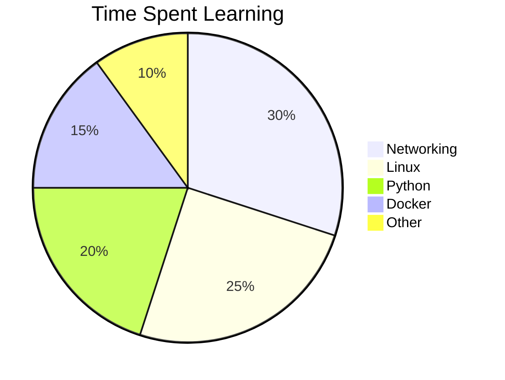
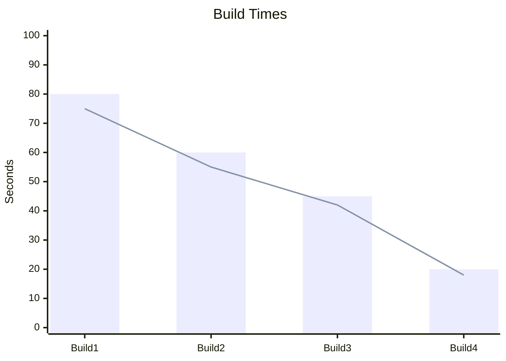
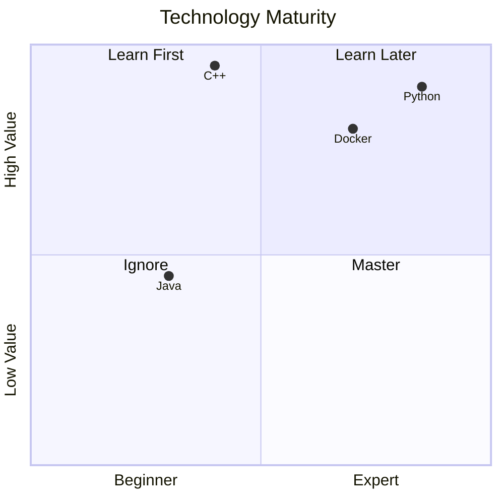
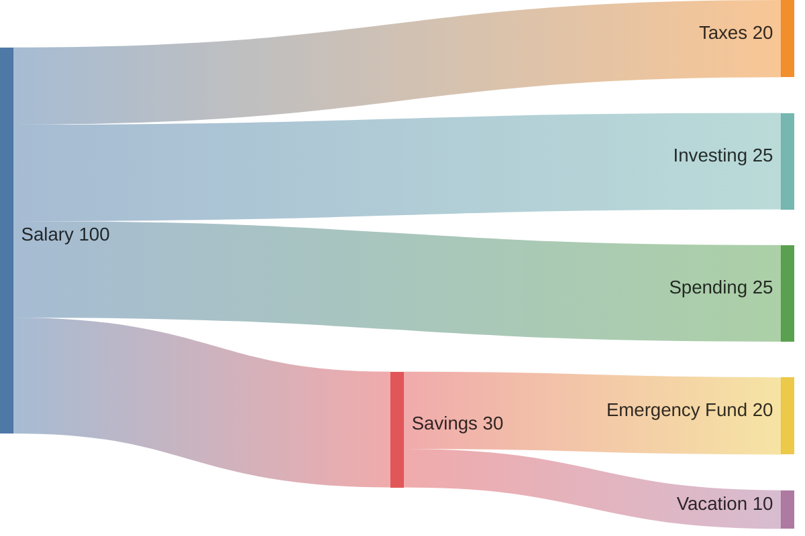

# Data

!!! example

    === "Table 1"

    | Method      | Description                          |
    | :----------- | :------------------------------------ |
    | `GET`       | :material-check:     Fetch resource  |
    | `PUT`       | :material-check-all: Update resource |
    | `DELETE`    | :material-close:     Delete resource |

    === "Table Center"

    | Method      | Description                          |
    | :-----------: | :------------------------------------: |
    | `GET`       | :material-check:     Fetch resource  |
    | `PUT`       | :material-check-all: Update resource |
    | `DELETE`    | :material-close:     Delete resource |

    === "Table Right"

    | Method      | Description                          |
    | ----------- | ------------------------------------ |
    | `GET`       | :material-check:     Fetch resource  |
    | `PUT`       | :material-check-all: Update resource |
    | `DELETE`    | :material-close:     Delete resource |

## Data Tables

### Data Table 1
| Method      | Description                          |
| ----------- | ------------------------------------ |
| `GET`       | :material-check:     Fetch resource  |
| `PUT`       | :material-check-all: Update resource |
| `DELETE`    | :material-close:     Delete resource |

### Column Align
| Method      | Description                          |
| :----------: | :-----------------------------------: |
| `GET`       | :material-check:     Fetch resource  |
| `PUT`       | :material-check-all: Update resource |
| `DELETE`    | :material-close:     Delete resource |

## Pie Chart

## XY Chart

## Quadrant Chart

## Sankey Diagram
