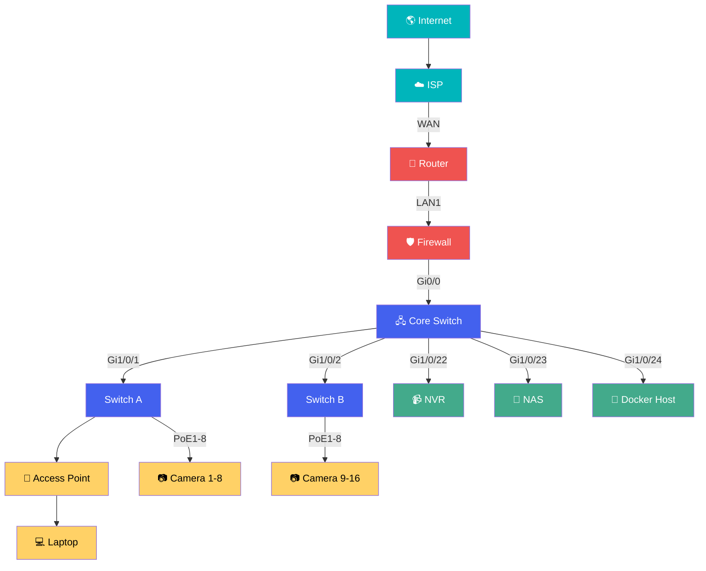

# 🖧 Relationship Diagrams

> Relationship diagrams illustrate **how systems communicate**, not where they are physically located.

!!! info "Purpose"

    Relationship diagrams answer questions like:

    - Which devices communicate?
    - Which interfaces connect them?
    - Which VLAN carries the traffic?
    - Where is the trust boundary?
    - What happens if a device fails?

---

## Enterprise Example
📖 Introduction

🖧 Hero Diagram

🎨 Color Legend

🔌 Port Naming Standards

🌐 Device Labeling Standards

🏷 VLAN Examples

📋 Engineering Best Practices

💡 Tips

🧪 Practice Lab

🏆 Challenge

📚 Snippet Library