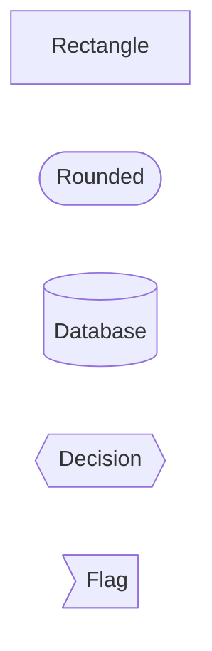
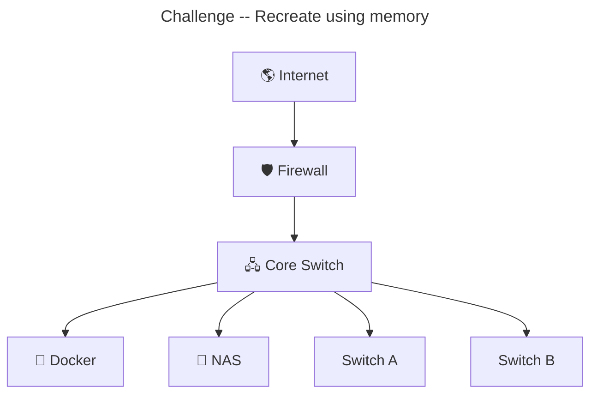
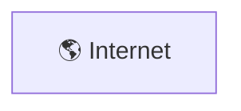
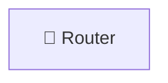
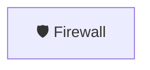
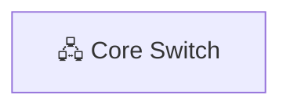
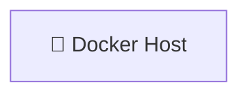

<div class="lab-hero">

<div class="lab-subtitle">

Engineering Laboratory

</div>

# 🖧 Relationship Diagrams

Visualizing systems, communication, and infrastructure using engineering-quality diagrams.

</div>

!!! abstract "Learning Objectives"

    By the end of this laboratory you will be able to

    - [ ] Read relationship diagrams
    - [ ] Design enterprise diagrams
    - [ ] Label interfaces
    - [ ] Document VLANs
    - [ ] Apply engineering color standards
---

## Warm-Up

The following diagram demonstrates a simple enterprise network.

Notice how:

- Devices are grouped by responsibility.
- Trust boundaries are clearly visible.
- Infrastructure flows left-to-right.
- Colors distinguish functional areas.


## 🖧 Enterprise Network Example

<div class="diagram-card">

    ```mermaid
    flowchart LR

    Internet["🌎 Internet"]
    Router["📡 Router"]
    Firewall["🛡️ Firewall"]
    Core["🖧 Core Switch"]
    Docker["🐳 Docker"]
    NAS["💾 NAS"]

    Internet --> Router
    Router --> Firewall
    Firewall --> Core
    Core --> Docker
    Core --> NAS

    classDef wan fill:#00b5bb,color:white
    classDef infra fill:#3f51b5,color:white
    classDef compute fill:#4caf50,color:white

    class Internet wan
    class Router,Firewall,Core infra
    class Docker,NAS compute
    ```

</div>


<div class="legend-grid">

<div class="legend-card">

### 🌎 WAN

Internet

ISP

Cloud

</div>

<div class="legend-card">

### 🛡 Security

Firewall

IDS

VPN

</div>

<div class="legend-card">

### 🖧 Infrastructure

Router

Switch

Core

</div>

<div class="legend-card">

### 🐳 Compute

Docker

NAS

NVR

</div>

</div>


## 🎨 Color Legend


| Color | Purpose | Example |
|:------:|:--------:|:--------:|
| 🟦 **Teal** | Internet / WAN | ISP, Cloud |
| 🔴 **Red** | Security | Firewall, IDS |
| 🔵 **Blue** | Network Infrastructure | Core & Access Switches |
| 🟢 **Green** | Compute & Storage | Docker, NAS, NVR |
| 🟡 **Yellow** | End Devices | PCs, Cameras, Phones |
| 🟣 **Purple** | Management | Controllers, Monitoring |


## 🧱 Device Shapes




## 🔌 Port Naming

!!! tip "Label links using real equipment interface names"

    === "Router"

        ```
        WAN
        LAN1
        LAN2
        LAN3
        LAN4
        ```

    === "Cisco"

        ```
        Gi1/0/1
        Gi1/0/2
        Gi1/0/24
        Te1/1/1
        ```

    === "PoE Switch"

        ```
        PoE1
        PoE2
        PoE8
        PoE16
        PoE24
        ```

    === "NVR"

        ```
        LAN
        HDMI
        USB
        PoE1
        PoE16
        ```


## 📐 Engineering Standards

<ul class="checklist">

<li>Label every interface.</li>

<li>Label every VLAN.</li>

<li>Label every trunk.</li>

<li>Show trust boundaries.</li>

<li>Use consistent colors.</li>

<li>Keep diagrams flowing left → right.</li>

<li>Group similar infrastructure.</li>

</ul>


## 🧪 Practice

!!! example "Lab 1"
    {: .exercise}

    ### Objective
        Add a second access switch.

    **Requirements**

    - Connect it to the Core Switch.
    - Label the uplink.
    - Add VLAN 20.
    - Add four PoE cameras.

    ??? question "Hints"
        1. -
        2. -
        3. -

    ??? success "Possible Solution"

        *(Leave empty until you've attempted it.)*

---

!!! example "Lab 2"

    ### Scenario

    Your company has purchased a second switch.

    **Your tasks**

    - Add the switch.
    - Connect it using **Gi1/0/23**.
    - Add **VLAN 30**.
    - Connect four cameras.
    - Color the switch blue.

---

!!! example "Lab 3"

    Add VLAN 10, 20 and 30.

---

!!! example "Lab 4"

    Add an isolated management network.


!!! warning "Engineering Challenge"

    {: .challenge}

    Build the entire diagram from memory.

    Add:

    - Interface labels
    - VLAN IDs
    - Colors
    - Classes


## 🏆 Challenge

Recreate the following from memory:



Rebuild this diagram using:
- "interface labels"
- "VLAN labels"
- "Colors"
- "Device classes"


## 🔬 Diagram Autopsy

Time to take things apart



> Represents the untrusted WAN.

---


> Layer 3 boundary between the ISP and the local network.

---


> Security enforcement point.

---


> Central aggregation  switch.

---


> Compute node running containers.

---

## 📚 Key Takeaways

By completing this laboratory you learned how to:

- Build relationship diagrams.
- Label interfaces correctly.
- Document VLANs.
- Apply engineering color conventions.
- Design reusable Mermaid diagrams.

➡ Continue to **Flowcharts** to learn process visualization.

### Rules on nesting languages

#### The Rule

```markdown
 Markdown

    ↓

   HTML

    ↓

  Mermaid

    ↓

  End Mermaid

    ↓

  End HTML

    ↓

  Markdown
```

#### The Visualization

```markdown
Markdown
│
├── Heading
│
├── Paragraph
│
├── HTML Card
│   │
│   ├── Mermaid Diagram
│   │
│   └── End Card
│
├── Paragraph
│
├── Admonition
│
└── Table
```

#### The Order of Operations

> At least get one thing working if nothing is going your way.

## Test Card

<div class="diagram-card">

    ```mermaid
    flowchart LR

    Internet --> Router
    Router --> Firewall
    Firewall --> Core
    ```

</div>