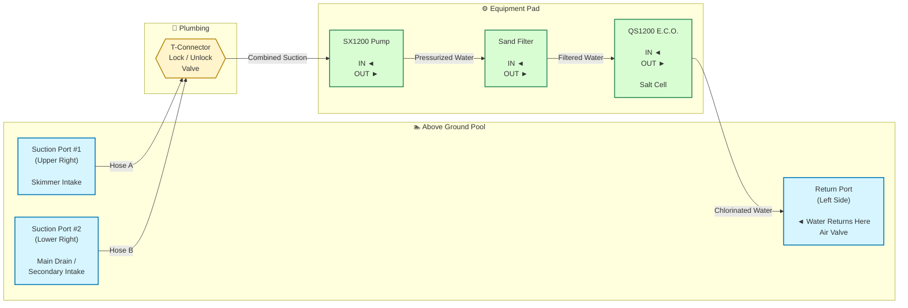

# Diagram
---

| Component     | IN                | OUT            | Notes                                       |
| ------------- | ----------------- | -------------- | ------------------------------------------- |
| Pool          | Return Port       | Suction Ports  | Water leaves from suction, returns to inlet |
| T-Connector   | Two suction hoses | One hose       | Combines both intakes                       |
| SX1200 Pump   | From pool         | To sand filter | Never run dry                               |
| Sand Filter   | Pump output       | E.C.O. input   | Backwash when pressure rises                |
| QS1200 E.C.O. | Sand filter       | Pool return    | Must always receive filtered water          |
