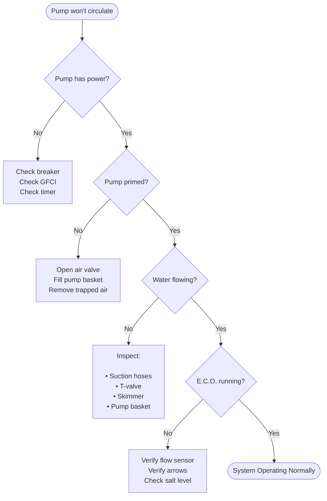

# Troubleshooting
---

!!! abstract "🕐 Five Minute Rule"

    Spend five minutes checking the simple things first.

    - Is there power?
    - Is there water?
    - Are the valves open?
    - Are the hoses connected?
    - Is the filter clean?

    Most problems are solved here.

---

## Quick Jump

- 🛑 Pump won't start
- 💧 Pump runs, but no water moves
- 🌊 Weak water flow
- 🧂 Salt system warning
- 💨 Air bubbles
- 🔄 Need to backwash
- 🚫 Things to Never Do

---

???+ success "✅ What Normal Looks Like"

    If everything is working correctly, you should see:

    - Strong water flow from the return jet.
    - Pump running smoothly without unusual noises.
    - No continuous stream of air bubbles.
    - QS1200 operating normally.
    - Water level approximately halfway up the skimmer opening.

---

??? warning "🛑 Pump won't start"

    ### Check these first

    - GFCI outlet has not tripped.
    - Circuit breaker is ON.
    - Timer (if installed) is ON.
    - Power cord is securely plugged in.
    - Reset button has been pressed.

    !!! warning "Motor hums but won't spin"

        Turn the pump OFF immediately.

        Continuing to run the pump can damage the motor.

---

??? warning "💧 Pump runs but no water is moving"

    Follow these steps in order:

    1. Verify the pool water level.
    2. Make sure both suction valves are open.
    3. Open the air relief valve to remove trapped air.
    4. Check for clogged intake screens.
    5. Inspect hoses for kinks.
    6. Verify the pump basket is full of water (primed).

    !!! tip

        Most circulation problems are caused by trapped air or low water level.

---

??? warning "🌊 Water flow is weak"

    Possible causes:

    - Dirty sand filter
    - Full pump basket
    - Low water level
    - Air leak on suction side
    - Clogged intake

    ### Recommended Action

    Start with the easiest checks:

    1. Empty the basket.
    2. Check the water level.
    3. Backwash the filter if needed.

---

??? warning "🧂 QS1200 Salt System isn't producing chlorine"

    Verify:

    - Pump is running.
    - Water is flowing normally.
    - Salt level is within specification.
    - Cell is clean.
    - Water is flowing in the correct direction through the unit.

    !!! info

        The QS1200 should always be installed **after** the sand filter.

---

??? info "🔄 Need to Backwash?"

    Perform a backwash if:

    - Water flow has noticeably decreased.
    - Filter pressure has increased.
    - Water appears dirty after normal operation.

    ### Backwash Procedure

    1. Turn pump OFF.
    2. Rotate valve to **BACKWASH**.
    3. Run for about 2 minutes.
    4. Turn OFF.
    5. Rotate to **RINSE**.
    6. Run for 30 seconds.
    7. Return valve to **FILTER**.
    8. Restart pump.

---

??? warning "💨 Air bubbles coming back into the pool"

    Small bubbles during startup are normal.

    Constant bubbles usually indicate:

    - Loose hose clamp
    - Loose pump lid
    - Cracked hose
    - Air leak on the suction side

    !!! tip

        Air leaks happen **before** the pump.

        Water leaks usually happen **after** the pump.

        That's a quick way to narrow down where to look.

---

??? danger "🚫 Never Do These"

    - Never run the pump without water.
    - Never run the QS1200 without water flow.
    - Never change the multiport valve while the pump is running.
    - Never operate with closed suction valves.
    - Never disconnect hoses while the system is pressurized.

---

??? question "❓Still Not Working?"

    Follow this order:

    1. Stop the pump.
    2. Open the **System Diagram** page.
    3. Verify every hose follows the arrows.
    4. Check every valve position.
    5. Restart using the **Startup** page.
    6. If it still doesn't work, begin troubleshooting again from the top.

    !!! success

        Don't skip around.

        Start at the beginning and work one step at a time.