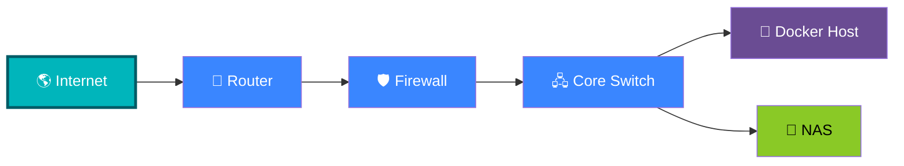
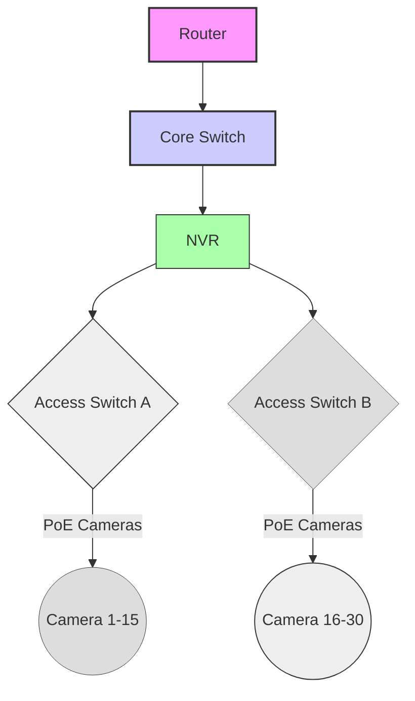

# Network & Technology Overview
---
# 🧜 Mermaid Laboratory

> Welcome to the Mermaid showcase for **Life Systems**.
>
> This page demonstrates diagrams, Material for MkDocs components, colors,
> icons, tabs, buttons, and interactive callouts that can be reused
> throughout the engineering documentation.

---



---


# Camera Network Topology

The following diagram illustrates the logical layout of the kennel camera network.



# Camera Network

## Purpose

...

## Physical Topology

```mermaid
...
```

## Logical Topology

```mermaid
...
```

## Packet Flow

```mermaid
...
```

## VLAN Layout

```mermaid
...
```

## Failure Domains

```mermaid
...
```

## Power Distribution

```mermaid
...
```

