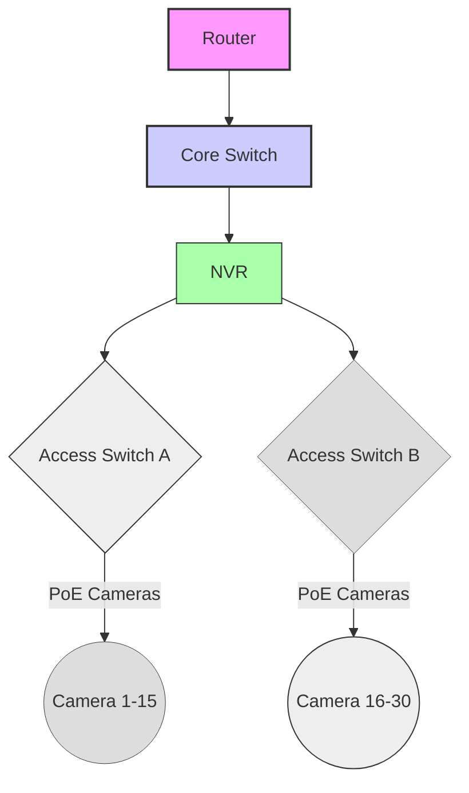

# Network & Technology Overview
---
# Camera Network Topology

The following diagram illustrates the logical layout of the kennel camera network.



# Camera Network

## Purpose

...

## Physical Topology

```mermaid
...
```

## Logical Topology

```mermaid
...
```

## Packet Flow

```mermaid
...
```

## VLAN Layout

```mermaid
...
```

## Failure Domains

```mermaid
...
```

## Power Distribution

```mermaid
...
```

