# Diagrams
===

!!! tip
    > Syntax: [Custom Shapes](https://mermaid.ai/open-source/syntax/flowchart.html)

## Networking Flowchart
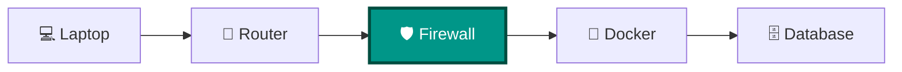

## Flowcharts
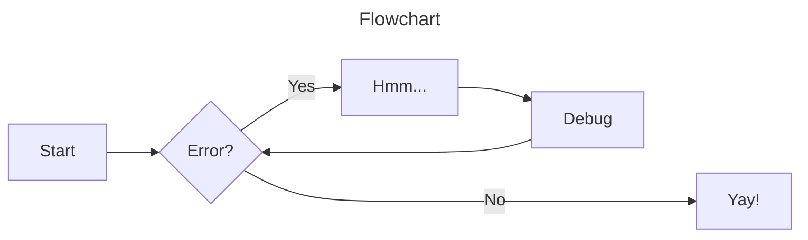
!!! tip
    > You can also use `graph` in place of flowchart

## Sequence Diagrams
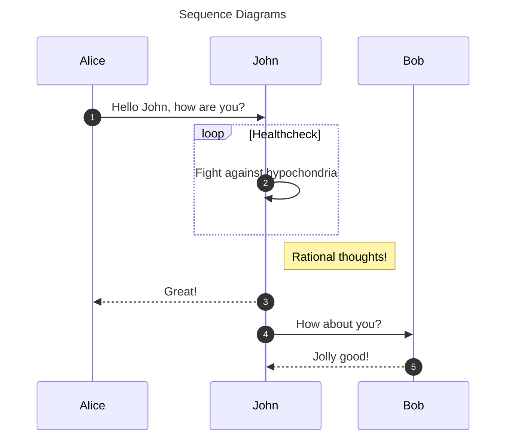

## State Diagrams
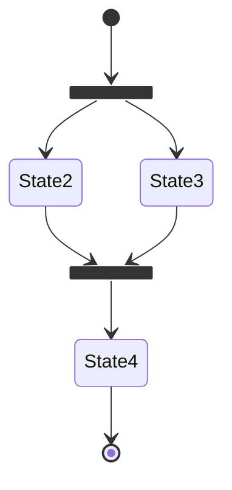

## Class Diagrams
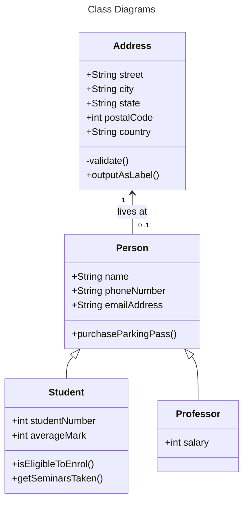

## Entity-Relationship Diagrams
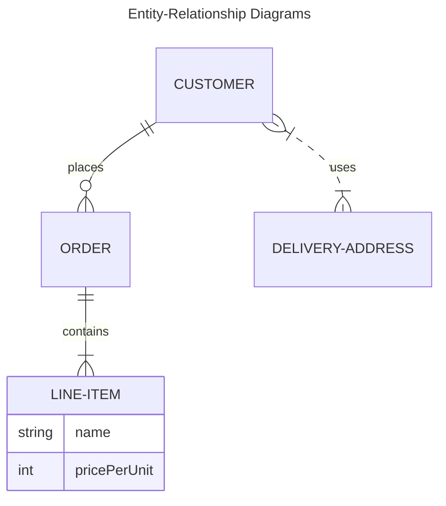
## Containers
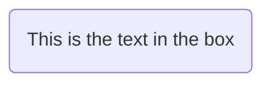

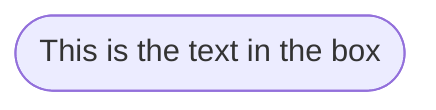

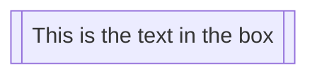

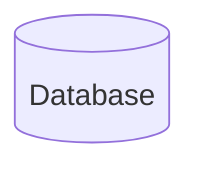

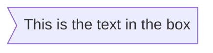

## Image Shape
```mermaid
flowchart TD
  %% My image with a constrained aspect ratio
  A@{ img: "https://mermaid.js.org/favicon.svg", label: "My example image label", pos: "t", h: 60, constraint: "on" }
```
???+ example
     - ***img:*** The URL of the image
     - ***label:*** Text label associated with the image. `<str>`
     - ***pos:*** Position label
    > - `t` - Top
    > - `b` - Bottom
     - ***w:*** Width of Image
     - ***h:*** Height of Image
     - ***Constraint:*** Constrain Node? *Default: `off`
    > - `on`
    > - `off`


### For dotted or thick links, the characters to add are equals signs or dots, as summed up in the following table:

| Length | 1 | 2 | 3 |
| ------ | --- | --- | --- |
Normal |--- |---- |----- |
Normal with arrow |--> |---> |----> |
Thick |=== |==== | ===== |
Thick with arrow |==> |===> |====> |
Dotted |-.- |-..- |-...- |
Dotted with arrow |-.-> |-..-> |-...-> |

---

## Subgraphs (Customizable Shapes)
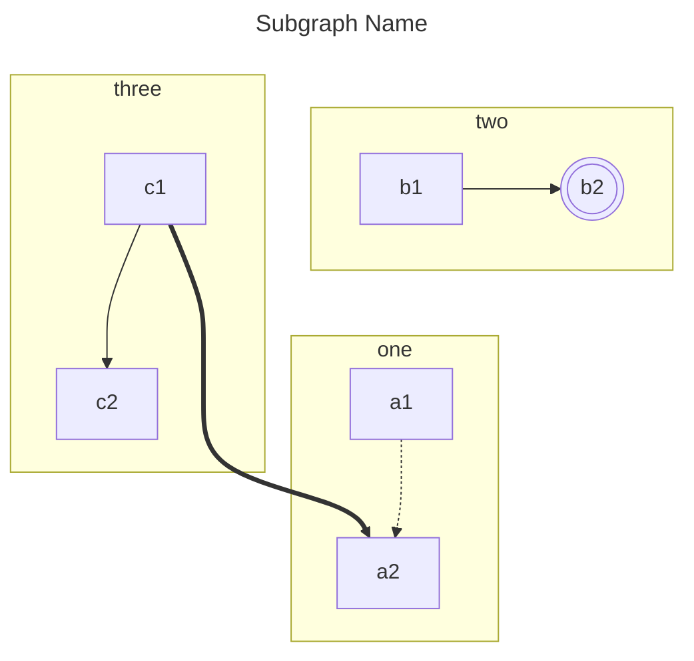

## Markdown Strings
The "Markdown Strings" feature enhances flowcharts and mind maps by offering a more versatile string type, which supports text formatting options such as **bold** and *italics*, and automatically wraps text within labels.

Code:
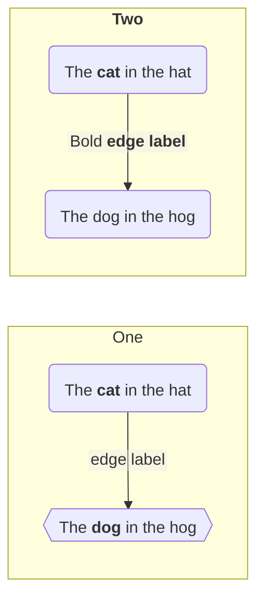
## Diagram Level Curve Style
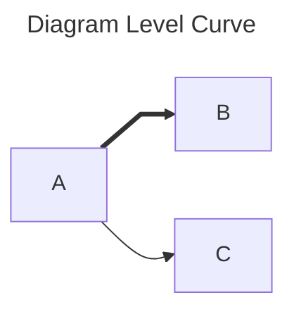

## Styling a Node
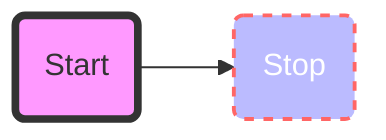
### Classes

!!! example "Ex.1: Define a single example:"
    `classDef className fill:#f9f,stroke:#333,stroke-width:4px;`

!!! example "Ex.2: Define multiple examples:"
    `classDef firstClassName,secondClassName font-size:12pt;`


!!! example "Ex.3: Attach a class to a Node:"
    `class nodeId1 className;`


!!! example "Ex.4: Attach a class to a list of Nodes:"
    `class nodeId1,nodeId2 className;


!!! info
> A shorter form of adding a class is to attach the classname to the node using the `:::` operator.
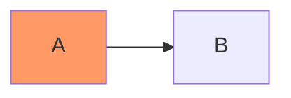

## Used when declaring multiple links between nodes:
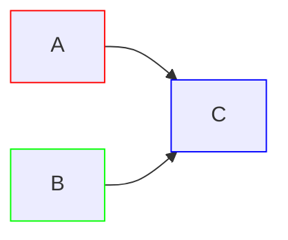


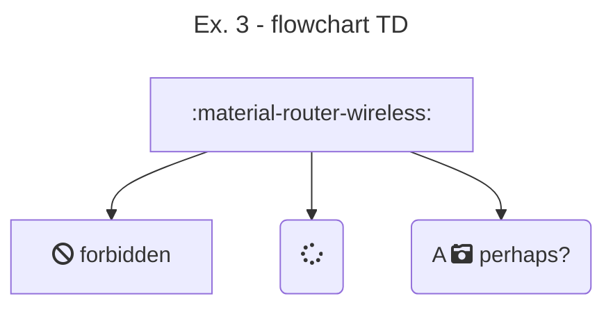

## Networking Flowchart -- Color
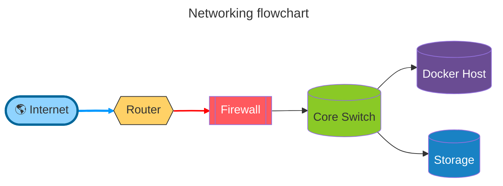

## Animated Packet flow
```mermaid
flowchart LR

A([Laptop]) -->|HTTPS| B((Router))
B --> C{Firewall}
C --> D[(Server)]

linkStyle default stroke:#00b5bb,stroke-width:4px;
```

## Mind Map
```mermaid
mindmap
root((Engineering))

    Networking
        Routing
        VLANs
        Firewalls

    Programming
        Python
        C++
        JavaScript

    Linux
        Bash
        Docker
        WSL

    Documentation
        MkDocs
        Mermaid
        Markdown
```

## Timeline
```mermaid
timeline
    title Engineering Journey

    2024 : Networking
         : Linux

    2025 : Python
         : Docker

    2026 : AI
         : Documentation
```

## Git Graph
```mermaid
gitGraph
commit
branch feature
checkout feature
commit
commit
checkout main
merge feature
commit
```

