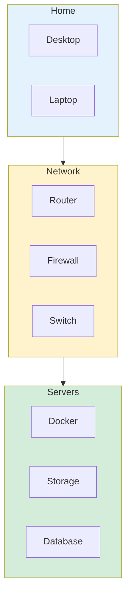
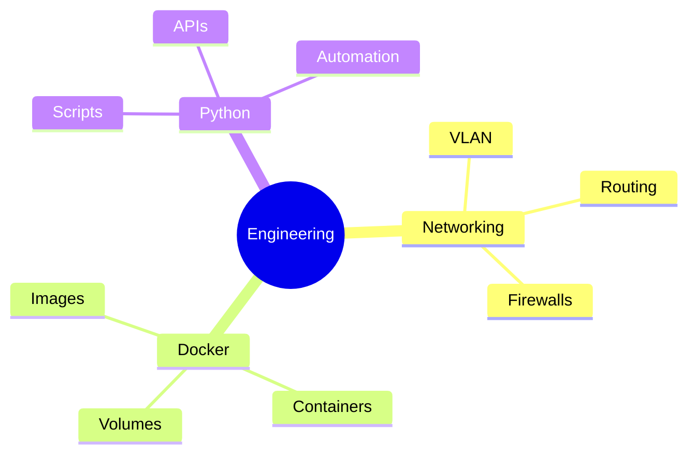

## Subgraphs

```mermaid
flowchart TB

subgraph Home
A1[Desktop]
A2[Laptop]
end

subgraph Network
B1[Router]
B2[Firewall]
B3[Switch]
end

subgraph Servers
C1[Docker]
C2[Storage]
C3[Database]
end

Home --> Network
Network --> Servers

style Home fill:#e3f2fd
style Network fill:#fff3cd
style Servers fill:#d4edda
```

## Playground
## Playground

Experiment with new Mermaid syntax below.

```mermaid
mindmap
root((Engineering))

    Networking
        VLAN
        Routing
        Firewalls

    Docker
        Images
        Containers
        Volumes

    Python
        Scripts
        APIs
        Automation
```