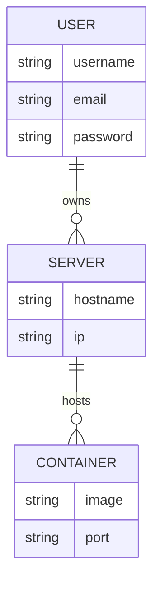

## Entity Relationship Diagram



## Requirement Diagram

```mermaid
requirementDiagram

requirement security {
    id: 1
    text: All traffic must be encrypted
    risk: High
    verifymethod: Test
}

element Firewall

Firewall - satisfies -> security
```

