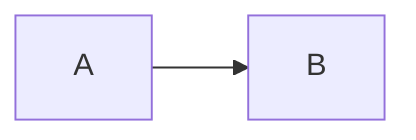

# Mermaid Test




??? note " "

    Lorem ipsum dolor sit amet, consectetur adipiscing elit. Nulla et euismod
    nulla. Curabitur feugiat, tortor non consequat finibus, justo purus auctor
    massa, nec semper lorem quam in massa.

???+ note "Outer Note"

    Lorem ipsum dolor sit amet, consectetur adipiscing elit. Nulla et euismod
    nulla. Curabitur feugiat, tortor non consequat finibus, justo purus auctor
    massa, nec semper lorem quam in massa.

    ???+ note "Inner Note"

        Lorem ipsum dolor sit amet, consectetur adipiscing elit. Nulla et euismod
        nulla. Curabitur feugiat, tortor non consequat finibus, justo purus auctor
        massa, nec semper lorem quam in massa.


!!! info inline end "Lorem ipsum"

    Lorem ipsum dolor sit amet, consectetur
    adipiscing elit. Nulla et euismod nulla.
    Curabitur feugiat, tortor non consequat
    finibus, justo purus auctor massa, nec
    semper lorem quam in massa.


!!! info inline "Lorem ipsum"

    Lorem ipsum dolor sit amet, consectetur
    adipiscing elit. Nulla et euismod nulla.
    Curabitur feugiat, tortor non consequat
    finibus, justo purus auctor massa, nec
    semper lorem quam in massa.


!!! pied-piper "Pied Piper"

    Lorem ipsum dolor sit amet, consectetur adipiscing elit. Nulla et
    euismod nulla. Curabitur feugiat, tortor non consequat finibus, justo
    purus auctor massa, nec semper lorem quam in massa.

## Buttons

[Subscribe to our newsletter](#){ .md-button }

[Subscribe to our newsletter](#){ .md-button .md-button--primary }

[Send :fontawesome-brands-youtube:{ .youtube }](#){ .md-button }

## Admonations

!!! note
    ```mermaid
    graph LR
    :simple-nim:
    A --> B --> C
    ```

:simple-nim:

!!! note

!!! abstract

!!! info

!!! tip

!!! success

!!! question

!!! warning

!!! failure

!!! danger

!!! bug

!!! example

!!! quote


## Content tabs

!!! example

    === "Unordered List"

        ``` markdown
        * Sed sagittis eleifend rutrum
        * Donec vitae suscipit est
        * Nulla tempor lobortis orci
        ```

    === "Ordered List"

        ``` markdown
        1. Sed sagittis eleifend rutrum
        2. Donec vitae suscipit est
        3. Nulla tempor lobortis orci
        ```


