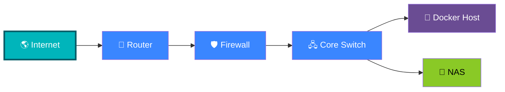
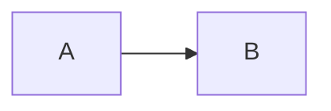

# Mermaid Test

# 🧜 Mermaid Laboratory

> Welcome to the Mermaid showcase for **Life Systems**.
>
> This page demonstrates diagrams, Material for MkDocs components, colors,
> icons, tabs, buttons, and interactive callouts that can be reused
> throughout the engineering documentation.

---







??? note

    Lorem ipsum dolor sit amet, consectetur adipiscing elit. Nulla et euismod
    nulla. Curabitur feugiat, tortor non consequat finibus, justo purus auctor
    massa, nec semper lorem quam in massa.

???+ info "Engineering Philosophy"

    Documentation should explain **how a system works**, not simply describe
    what exists.

    Good documentation answers:

    - Why does it exist?
    - How does data flow?
    - What breaks if this component fails?
    - Where does security fit?

    ??? success "Example"

        Every networking document in **Life Systems** should include a
        Mermaid architecture diagram whenever appropriate.


!!! tip inline end "💡 Documentation Tip"

    Mermaid diagrams should show **relationships**, not implementation details.

!!! warning inline "⚠️ Keep it Simple"

    If your Mermaid diagram has more than about 25 nodes,
    consider breaking it into multiple diagrams.


!!! pied-piper "Pied Piper"

    Lorem ipsum dolor sit amet, consectetur adipiscing elit. Nulla et
    euismod nulla. Curabitur feugiat, tortor non consequat finibus, justo
    purus auctor massa, nec semper lorem quam in massa.

## Buttons

[🏠 Home](../index.md){ .md-button .md-button--primary }

[📚 Networking](../tech/overview.md){ .md-button }

[🐳 Docker](../docker.md){ .md-button }

[⚙️ Mermaid Docs](https://mermaid.js.org){ .md-button }

## Admonations

!!! example "Packet Flow"

    ```mermaid
    flowchart LR

    Laptop["💻 Laptop"]
    Router["📡 Router"]
    Firewall["🛡️ Firewall"]
    Docker["🐳 Docker"]

    Laptop --> Router --> Firewall --> Docker
    ```


## Callout Styles

!!! note "General Note"
    Documentation for everyone.

!!! abstract "Architecture"
    High-level system overview.

!!! info "Information"
    Useful background knowledge.

!!! tip "Best Practice"
    Recommended workflow.

!!! success "Completed"
    Deployment succeeded.

!!! question "Think About"
    What happens if the firewall fails?

!!! warning "Warning"
    Opening unnecessary ports increases attack surface.

!!! failure "Failure"
    Build failed because dependencies are missing.

!!! danger "Danger"
    Never expose your Docker socket to the Internet.

!!! bug "Bug"
    Mermaid rendered incorrectly because of malformed syntax.

!!! example "Example"
    A practical implementation.

!!! quote "Engineering Principle"
    "Simple systems are easier to maintain."


## Better Tabs

### Configuration Examples

=== "Docker"

    ```yaml
    services:
      app:
        image: nginx
    ```

=== "Python"

    ```python
    print("Hello Engineering")
    ```

=== "PowerShell"

    ```powershell
    docker compose up -d
    ```

=== "Linux"

    ```bash
    docker compose logs -f
    ```

## Nested Tabs

!!! example

    === "Unordered List"

        ``` markdown
        * Sed sagittis eleifend rutrum
        * Donec vitae suscipit est
        * Nulla tempor lobortis orci
        ```

    === "Ordered List"

        ``` markdown
        1. Sed sagittis eleifend rutrum
        2. Donec vitae suscipit est
        3. Nulla tempor lobortis orci
        ```


